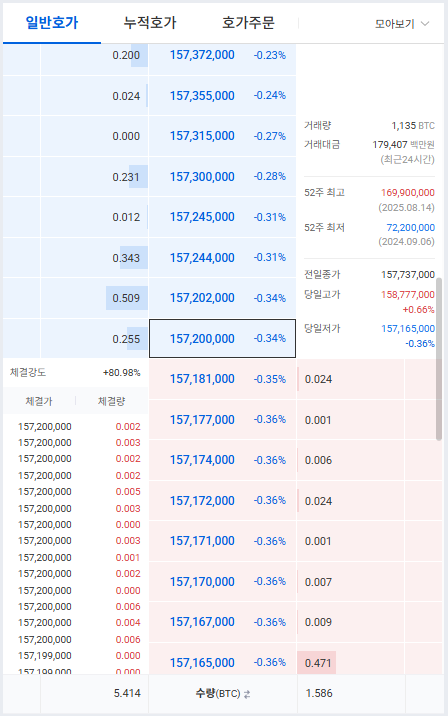
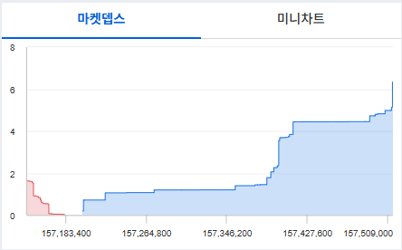

# 호가창(Order Book)

주식·선물·암호화폐 같은 거래소 시장에서 매수·매도 주문이 쌓여 있는 현황을 보여주는 창 

## 용어

- 호가
  - 매수자·매도자가 “나는 이 가격에 사겠다/팔겠다”고 부르는 가격
- 최우선 매수호가(bid1, best bid)
  - 지금 당장 체결될 수 있는 가장 높은 매수 가격
- 최우선 매도호가(offer1, best offer) (ask 라고도 함)
  - 지금 당장 체결될 수 있는 가장 낮은 매수 가격
- 스프레드(spread)
  - 최우선 매수호가와 최우선 매도호가의 간격

## 구성요소

### 매도호가 (bid side)

- 위쪽에 표시됨
- 팔고싶은 사람들의 주문
- 낮은가격부터 순서대로 쌓임

### 매수호가 (offer side)

- 아래쪽에 표시됨
- 사고싶은 사람들의 주문
- 높은가격부터 순서대로 쌓임

## 거래시 주요 포인트

### 호가 잔량 균형

- 매수 대기 물량이 훨씬 많으면 “지지(bid support)”가 두텁다고 하고, 매도 대기 물량이 많으면 “저항(ask wall)”이 두텁다고 말함.
- 다만 허수 물량(fake order)도 있으니 그대로 믿으면 안 됨.

### 호가 변동 속도

- 잔량 숫자 자체보다도 “몇 초 안에 얼마나 빨리 변하냐”가 중요함.
- 주문이 빨리 사라지고 쌓이면 강한 변동성을 의미함.

### 체결 강도

$$
체결강도 = \frac{매수체결량}{매도체결량}
$$