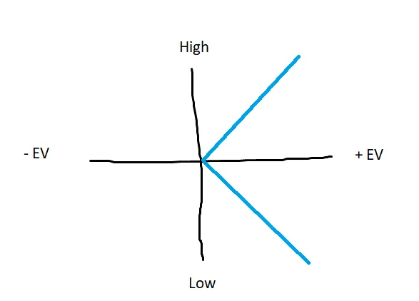
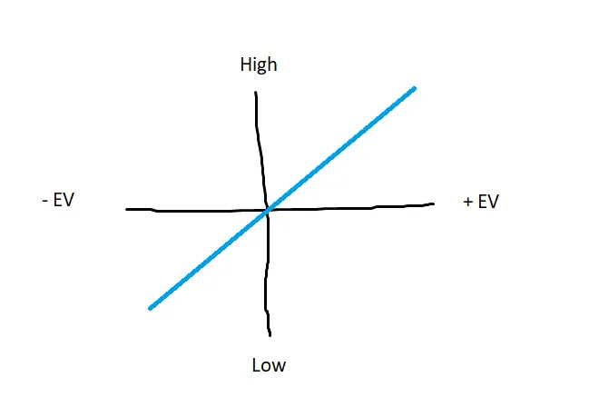
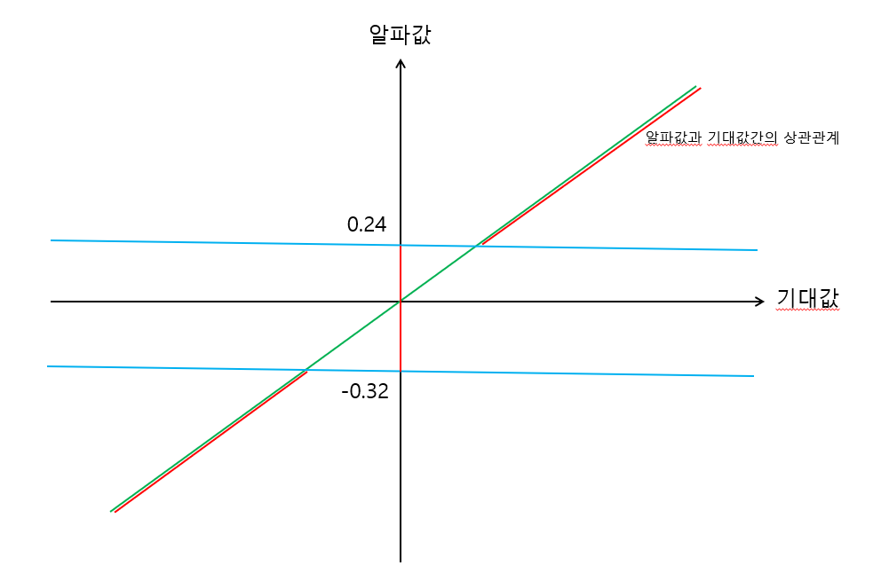

### RLS 소개

- 일반적인 퀀트 투자 프로세스는 [데이터 → 공식 → 예측 → 포트폴리오 최적화 → 실행]이다.
- RLS는 예측과 포트폴리오 최적화를 단순화해주는 방법이다.
- RLS가 아닌 일반적인 방법은 다음과 같다.
    - 특정 공식(알파)을 머신러닝 모델에 넣어 자산별 기대값과 변동성을 예측
    - 이를 포트폴리오 최적화 모델에 입력
- 리서쳐들은 이런 시스템을 구축하기보다 공식을 만드는데 시간을 쓰는 것이 효율적이어서,  RLS가 그럭저럭 괜찮은 도구가 될 수 있다.
    - RLS는 특정 공식(알파)의 값으로 순위를 매기고 상위 *%를 롱, *%를 숏하는 방식이다.
    - 검증은 백테스트를 통해 한다.

### RLS 방법

1. 모든 자산을 특정 공식(알파)로 값을 매긴다.
2. z-score 표준화를 한다.
3. 상위 10%와 하위 10%로 나누어 각각 롱/숏한다.
    - 이때, 거래 수수료와 스프레드 비용을 고려한다.
    - 각 종목의 변동성을 고려하여 비중을 조정한다.
4. 백테스트를 통해 성과 지표를 확인한다.
    - **CAGR** → 복리 기준 연평균 성장률
    - **Cumulative Return** → 누적 수익률
    - **Sharpe Ratio** → 위험(변동성) 대비 초과 수익률
    - **Sortino Ratio** → 하방 위험(손실) 대비 초과 수익률
    - **Max Drawdown** → 가장 많이 잃었던 최대 손실 폭

### RLS의 단점과 해결 방법

- 기대값과 알파값을 선형관계로 가정하여 예측이 부정확하다.
    - 실제 데이터에서는 양수든 음수든 극단적으로 크면 수익이 잘 나고, 0 근처에서는 별 효과가 없을 수도 있다. (비선형관계일 수 있다)

→ 알파값에 절대값을 취한 후, z-score 표준화를 취하면 비선형 예측모델을 다시 선형 예측 모델로 만들 수 있다.

실제 알파값과 기대값의 상관관계

알파값에 절대값을 취하고 표준화 → 선형회귀로 예측 가능

- 과도한 포트폴리오 회전을 만들 수 있다.
    - 현재 포트폴리오가 종목당 0.0014%/시간 의 기대수익을 가짐
    - 선물 거래 수수료 비용이 0.0035%라면, 양쪽 포지션을 모두 바꾸는데 0.007%가 발생
    - 새 포트폴리오가 종목당 0.0016%/시간 의 기대수익을 가진다면
    - 실제로는 (0.0016% - 0.007% = ) 0.009%/시간 의 기대수익이 되므로 기존 0.0014%보다 낮아지는 단점 발생함
- 알파값과 기대값 간의 관계를 빠르게 예측하여 해결할 수 있다.
    - 거래비용 0.007%는 알파값 0.24 혹은 -0.32에 해당한다고 가정하자.
    - [0.24 -0.32] 구간의 기대수익률을 0으로 조정한다.
    

위 그림에서 초록색 직선(조정 전)을 빨간색 비선형 직선(조정 후)로 컷오프
    

### 실제 사용

대부분의 경우 ORLS까지 가지 않고, 그냥 RLS로 충분하다. 주로 알파 탐색용으로 쓰인다. 정말 괜찮은 전략이라고 판단되면 그때 제대로 머신러닝과 포트폴리오 최적화로 정밀 테스트를 실시한다.

어떤 사람들은 최종 전략으로 RLS를 사용하기도 하며 실제로 많은 경우 괜찮다. (하지만 최선의 방법은 아니다)

필자는 과적합 여부를 판단하는데 사용하기도 한다.

좋은 알파인지 확인하려면 RLS를 20%, 10%, 5%등 다양한 컷오프로 실험해보면 된다. 어디서든 잘 작동한다면 견고한 알파일 가능성이 높다. (아니라면 과적합의 가능성이 있다)